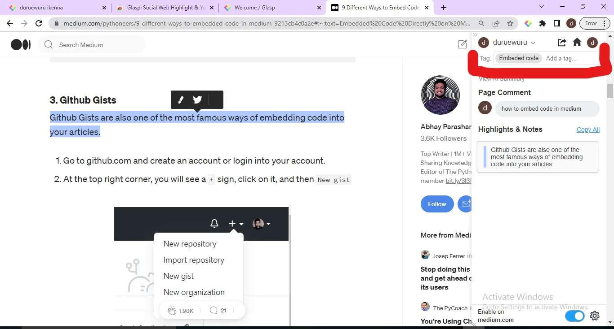
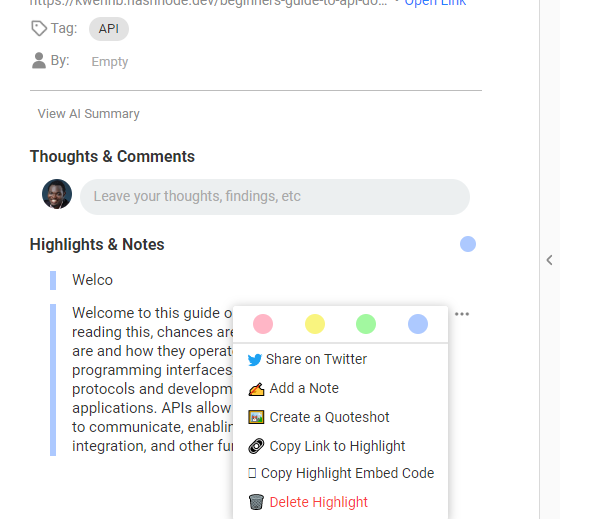
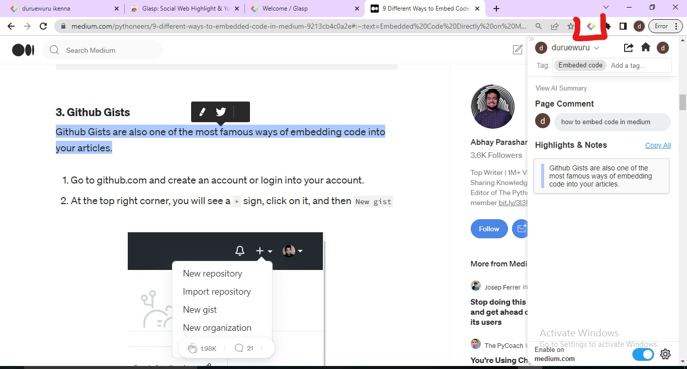
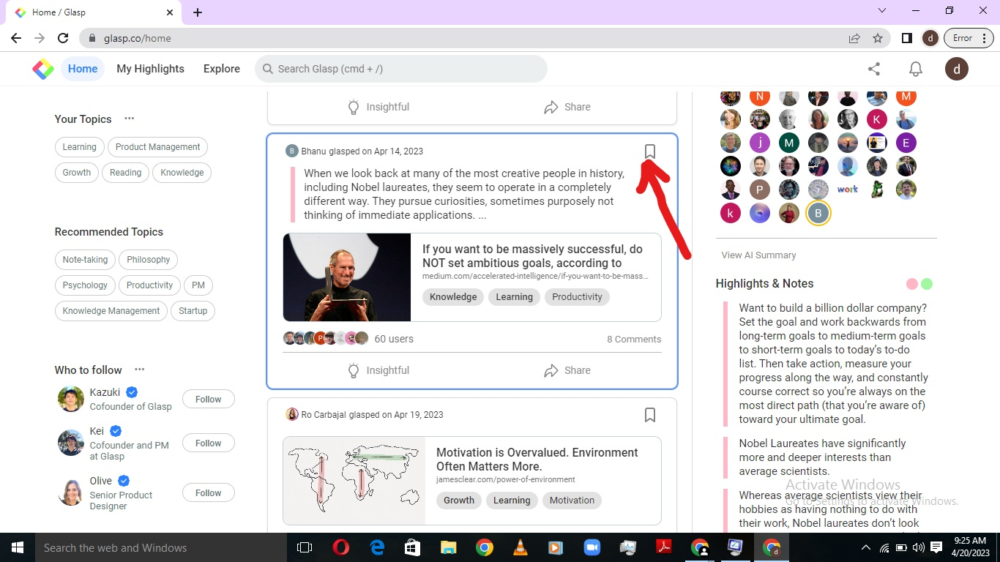

# Glasp, a Game Changer to Highlighting

This is an introductory guide to Glasp. This article is for beginners and for those who are hearing about Glasp for the first time. This article will give you a complete overview of the software, how to use it, its Limitations, advantages and unique features.

# Table of Content

- [Glasp, a Game Changer to Highlighting](#glasp-a-game-changer-to-highlighting)
- [Table of Content](#table-of-content)
- [What is Glasp?](#what-is-glasp)
- [Features and Functions of Glasp](#features-and-functions-of-glasp)
    - [Highlighting text and videos](#highlighting-text-and-videos)
    - [Tag Feature](#tag-feature)
    - [View other's Highlights](#view-others-highlights)
    - [Topics](#topics)
    - [Highlight to Picture Converter](#highlight-to-picture-converter)
    - [Share to social media](#share-to-social-media)
    - [Transcribe Youtube videos](#transcribe-youtube-videos)
- [How to use Glasp](#how-to-use-glasp)
  - [Installation](#installation)
  - [Creating an Account](#creating-an-account)
    - [Set Up](#set-up)
- [How to Highlight a Text With Glasp](#how-to-highlight-a-text-with-glasp)
- [How to Highlight a Video With Glasp](#how-to-highlight-a-video-with-glasp)
- [How to Transcribe a Youtube Video](#how-to-transcribe-a-youtube-video)
- [Home Page](#home-page)
    - [Following](#following)
      - [How To Follow Someone](#how-to-follow-someone)
    - [Topics](#topics-1)
    - [Popular](#popular)
    - [Saving a Highlight](#saving-a-highlight)
    - [Your Topics](#your-topics)
    - [Who to follow](#who-to-follow)
- [My Highlights](#my-highlights)
  - [Articles](#articles)
  - [Favourite](#favourite)
  - [Saved](#saved)
  - [Kindle](#kindle)
  - [videos](#videos)
  - [Download icon](#download-icon)
  - [profile](#profile)
- [Limitations of Glaps](#limitations-of-glaps)
- [Conclusion](#conclusion)

# What is Glasp?

Glasp is a web browser extension that allows you to highlight any content on a web page on the Internet. Glasp is not restricted to only texts but you can also use it to highlight videos and images on various web pages.

Glasp stores these highlights for you and keeps them so you can easily access them or make reference to them at a later time.

.png>)

Glasp solves the problem 'bookmarking' a web page creates. Bookmarking a web page can be tasking. when you bookmark a web page, you might not even know where the exact text you are interested in is on the webpage. Also, you can't arrange your bookmarks orderly, add comments and notes about them, or use tags to group them.
This makes accessing texts on bookmarked or saved web pages difficult.

Glasp solves these problems. With Glasp you can highlight a particular text in an article and Glasp stores not only the text you highlighted but also keeps the URL of the webpage where the text is gotten from so you can revisit it at a later time. And when you revisit the webpage, you will still see the highlighted text on the web page

.png>)

# Features and Functions of Glasp

Glasp has a lot of features and functions that help organize the text you highlight and increase your productivity

### Highlighting text and videos

.png>)

You can highlight text, video and images on a webpage with Glasp. The highlighted text or video is stored and you can view them later.

### Tag Feature

Glasp has a tag feature which you can use to arrange and group your highlights into different categories. This helps you to arrange your highlights better for easy access at a later time.

### View other's Highlights

.png>)
Glasp is like a social media platform. But instead of sharing thoughts and opinions, your highlighted texts are shared with everyone. This means that the text and videos you highlight are not private. It can be seen by every Glasp user who either follows you or searches for your profile.

You can follow different people too and see their highlights.

Comments are allowed about each highlight and people can share their thoughts.

### Topics

.png>)
You can follow different topics and tags on Glasp. There are different topics of interest you can follow based on the tag people give to their highlights. When you follow any topic, you can see the different texts and articles relating to that topic that people highlight.

There are a wide variety of topics such as philosophy, knowledge, note-taking, sports, NFT etc.

### Highlight to Picture Converter

.png>)
You can create a quote image for your highlights and share them on your social media platform like Twitter, Instagram and Facebook. You can also download the quote image to your remote computer.

### Share to social media

You can link your different social media accounts to Glasp so people can follow you there.
With Glasp you can easily share your highlighted text on your social media handle for others to see.

You can share your highlights either as an image or you can send your Glasp link to others to view.

### Transcribe Youtube videos

.png>)
In addition to highlighting videos, Glasp enables you to easily get the full transcript of a Youtube video. This means that you can copy out the full transcript and read it as an article instead of watching the video.

# How to use Glasp

## Installation

Glasp is a web browser extension. it works only on Safari and Google Chrome for now. To install Glasp on your browser, you need to go to your web browser store and Install it.

- If you are using Chrome visit [Chrome web store](#https://chrome.google.com/webstore/detail/glasp-social-web-highligh/blillmbchncajnhkjfdnincfndboieik)

.png>)

- If you are using Safari visit [Mac App Store](#https://apps.apple.com/us/app/glasp-social-web-highlighter/id1605690124)

.png>)

These Links will take you directly to the Glasp page on the store

- On Google Chrome, Click on 'add to Chrome' and the extension will be installed on your browser.

- On Safari, click on 'Install' and it will be installed on the browser.

After installation, you will get a prompt asking you to pin the Glasp extension to the extension bar. Follow the instructions and pin it.

.png>)

After pinning it, the Glasp icon will always be visible on your browser whenever you visit a page that you can Glasp a text from.

But when you visit a page you can't Glasp, it will show an off sign.
_LI.jpg>)

## Creating an Account

After installing the Glasp extension the next thing you need to do is to create an account.

1. visit [Glasp official website](#https://glasp.co)

.png>)

2. Click on the Sign-up button and you will get to the sign-up page.

.png>)

3. Click on 'continue with Google'

4. A pop-up window will appear where you would enter your email and password.

.png>)

5. After you've done this, you will be taken to the set-up page.

### Set Up

As a first-time user, you will be asked to follow up on 10 topics. This is to enable you to get highlighted texts relating to those topics.

.png>)

Choose the topics you want and submit them. Your home page would load

# How to Highlight a Text With Glasp

1. Visit the webpage you wan to highlight a text from.
2. Highlight the text that intrests You. You will see 4 coloured buttons hover the text you highlighted.
   .png>)
3. Pick any colour you want.The highlight would then be saved automatically to your account.
   .png>)
4. Click on the Glasp extension icon to add other details such as notes, Comments, Tags and author.
   .png>)

# How to Highlight a Video With Glasp

1. click on the video you want to highlight
   .png>)
2. Highlight the title or texts in the description. You will see 4 coloured buttons hover the text you highlighted.
   .png>)
3. Pick any colour you want.The highlight would then be saved automatically to your account.
   .png>)

# How to Transcribe a Youtube Video

1. click on the video you want to highlight
   .png>)

2. Click on the Glasp 'Transcribe and summary' button at the top right.
   _LI.jpg>)

3. You will then see the full Transcript of the video.
   .png>)

# Home Page

.png>)

The home page is the first page you would see when you log into Glasp. On the home page, you can view highlights from the people you follow, the topics you are following and the highlights that are popular among other Glasp users.

You can also see the different topics you follow and recommended topics.

Let's take a look at the different sections of the home page:

### Following

.png>)
On the 'following' page, you can follow like-minded people and see the highlights they've made.

The goal of Glaps is to create a knowledge bank where people store their highlights and the articles they read thereby allowing other people to get a peek into what they are reading and the lessons they are learning.

#### How To Follow Someone

1. click on their profile name or picture. This would take you to the person's profile where you can see all their activities.
   _LI.jpg>)
2. Click on the follow button at the top left.
3. You can also ask them anything by clicking on the 'Ask' button beside the Follow button.
   _LI.jpg>)

4. If you find a highlight insightful and interesting you can let the user know by clicking on the insightful button.

5. Highlights are shareable, and you can share them by clicking on the 'share button' beside the insightful button.

### Topics

.png>)

View both new and old highlights from the topics you are following. for example, if you follow a topic like 'note-taking' or ' UI/UX', you would see highlighted texts people made that they gave the tag' UI/Ux' or 'Note-taking'.

### Popular

.png>)

The popular page shows you all the highlights that are popular among users. It also shows you the highlights that have many interactions, saves and comments by Glasp. You can also save Glasp and follow people from any of the pages.

### Saving a Highlight

You can save a highlight and view it later by clicking on the 'save icon' at the top right of a highlight.

If you want to view saved highlights,

1. Go to your 'Highlights' 
2. click on 'saved' and you would see all the highlights you've saved from people.
   _LI.jpg>)

### Your Topics

This shows all the topics you follow. You can add more topics or remove topics from here.

### Who to follow

See suggestions on different people to follow. You can also search for users, websites or tags using the search bar at the top.

The bar on the right gives you the complete view of everything that was highlighted in the article

Clicking on the link takes you to the web page where the highlight was taken from.

# My Highlights

This page is where you see everything about you on Glasp. There are a lot of functions you can perform here and features to find.

1. You can edit your profile
2. See the articles you highlighted.
3. View articles you were tagged as the author.
4. Favourite highlight.
5. Saved
6. Kindle
7. Videos

## Articles

.png>)
The article section shows you the highlights you've made from different web pages. It displays the date the highlight was made, how many highlight you did on the article and a link to the article.

For each highlight, on the right panel, you would see the title of the article, the link, the tag you gave to it, your thoughts and comments about the highlight and the highlighted texts.

## Favourite

.png>)
Favourite shows you all the highlights you marked as your favourite.

To add a highlight to your favourite,

1. On the top right of every highlight, you would see the favourite 'star icon'.
2. Click on it, and that highlight will be added to your favourite.

## Saved

_LI.jpg>)
When you view highlights from other people, you can save them and come back to them by clicking on the save icon at the top right of the highlight.

The saved highlights are displayed here on the saved pages.

## Kindle

While reading on Amazon Kindle you can highlight texts from a book. The text from one book can be compiled into a pdf or markdown depending on your choice. You can view your highlights from Kindle in this section

## videos

All your highlighted videos from Youtube and other sites are saved here.

## Download icon

When you select any highlight from an article, you can print them or download them in a text, pdf or markdown format.

Select the highlight you want to print
click on the download icon
chose the format you want
It will be downloaded into your pc

## profile

.png>)
Clicking the 3 dots beside your profile picture takes you to your profile. You can edit your profile from here.
you can add your social media handles, your blog link, change your username and all other things people can associate with you.

# Limitations of Glaps

There are sites that you cannot use Glasp on. Glasp is not supported on those sites. For example, note-taking apps, banking apps, financial software, some search engines etc. This is because these apps contain sensitive and private information which might not be proper to show to the general public.
_LI.jpg>)
Remember that all highlights made using Glaps are open and any Glaps user can view the content, so having for example your credit card information highlighted will put you at risk cause someone might steal the info and rob you.

# Conclusion

This is a beginner friendly introduction to Glasp. It was written for those who are just hearing about Glasp for the first time and want to know more about the softare and how to use it.

Glasp is used to highlight texts and videos on different web pages. It helps you to pull different articles together and refer to them later. Your highlights are saved on your Glasp page and it is visible to everyone.

Glasp works like a social media platform but instead of people sharing posts and images, their highlighted contents serves as their posts and people can interact with it and share it to other people.
